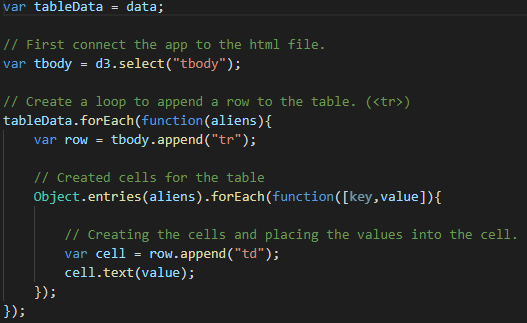
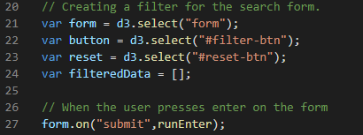
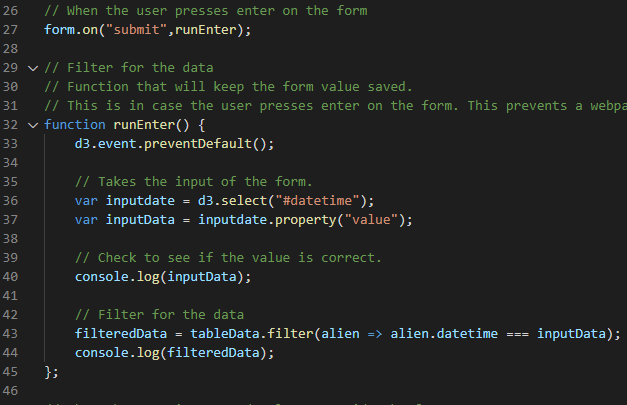
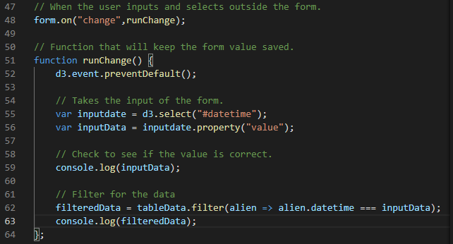
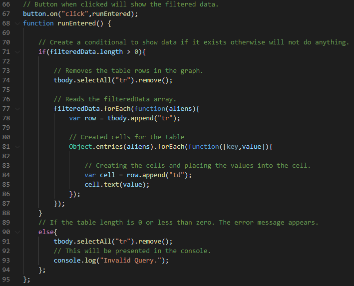
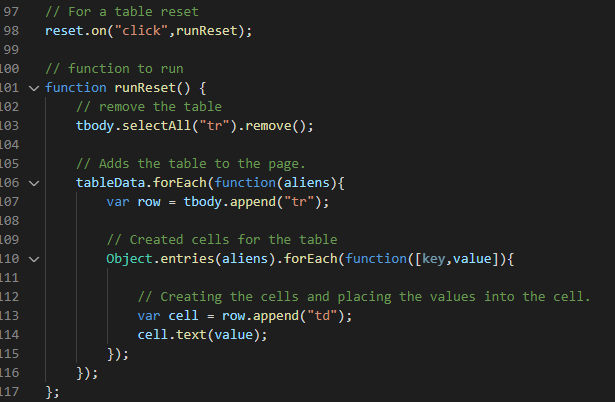

# Alien Information Webpage

## Tools

---

* Javascript

* HTML

## Purpose

---

This webpage shows the uninformed people of Earth that aliens exists. With hard hitting evidence and reliable sources the table provided shows all of the locations and types of alien space craft.

## UFO-Level-1

---

Within this folder holds basic code for our webpage. The data and the app are both found in the ```static/js``` directory. The purpose is to allow the user to filter through the table by the datetime.

## UFO-Level-2

---

Going one step further as we should with the aliens. This directory holds the same qualities as UFO Level 1 but has added filter functionalities. The data and the app are both found in the ```static/js``` directory.

## Step 1: Populate the table

---

The first step of the file is to create a table for the webpage.

1. Read the data.js file

2. Use d3 to select the table body

3. Append a row for each siting

4. Append a cell for each field(Date, City, State, Country, Shape, Duration, Comments)



## Step 2: Selecting Forms and Buttons

---

Step 2 is to use d3 and select the forms and buttons for event listeners.



## Step 3: Event Listeners and Updating the table

---

The event listener will run and find the value of the filled out form. The prior shows runs when the user presses enter. The latter runs the form changes. With the value saved, it is then used to filter through the data.





## Step 4: Updating the table

---

When the submit button is clicked the table will be updated. If the form is empty or if the filtered array length is zero, the table would be empty.



## Step 5 : Resetting the table

---

When the reset button is pressed the table is reset and the original unfiltered table is shown.

